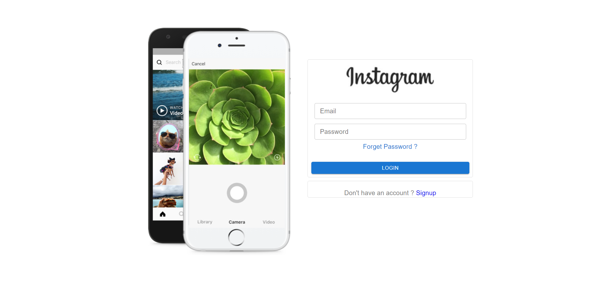
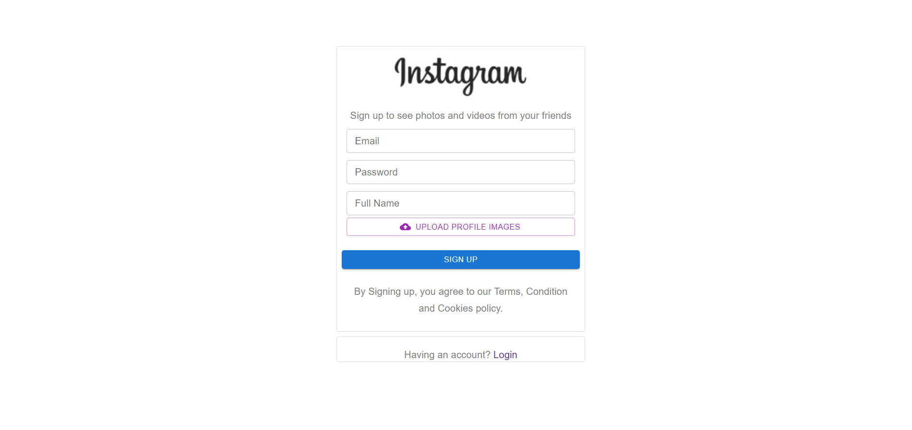
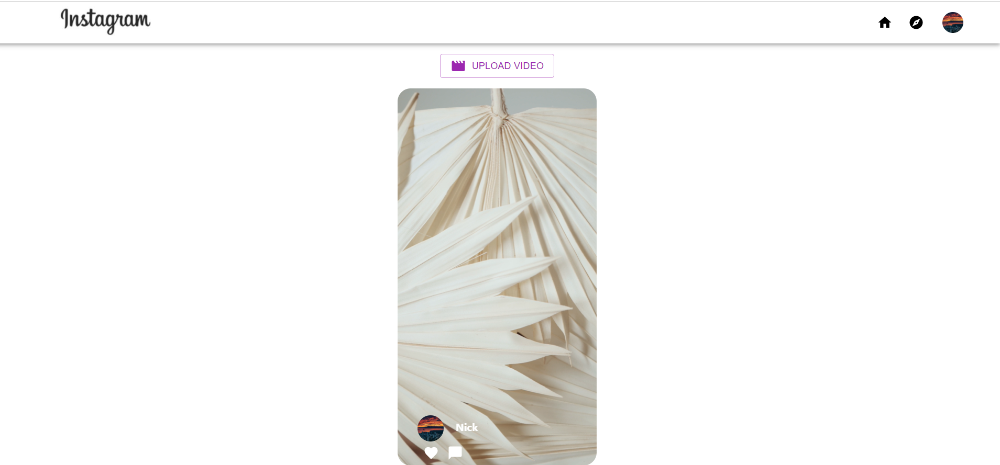
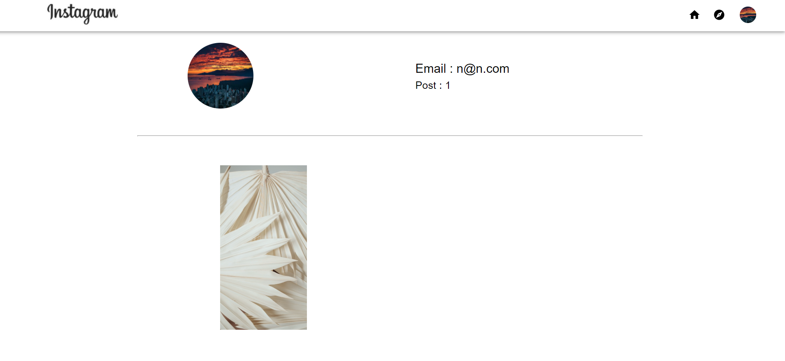

# [Reel Clone](https://reel-62ffc.web.app)

## Features

> - Created a Reels Clonein which users can login, signup, logout, post new videos, like and comment, video autoplay feature is also implemented.
> - Used Protected Route concept.
> - For autoplay play, if the video is in 60% of the screen and if it is intersecting it will automatically play.

## Tech Stack Used:

> - Reactjs
> - Material-UI
> - Firebase
> - Context API
> - react-router-dom
> - Intersection Observer API

## Screenshots

> Login
> 

> SignUp
> 

> ReelPage
> 

> Profile Page
> 
